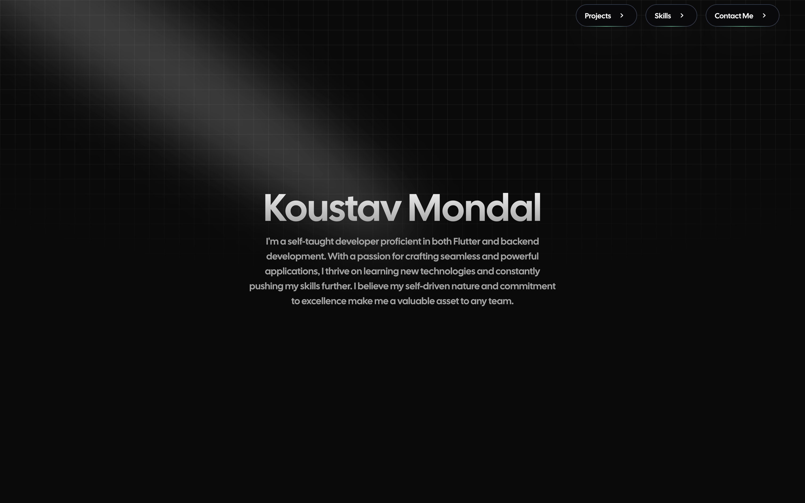

# Koustav Mondal - Portfolio


<br></br>
<a href="https://koustav.dev">
    
</a>

## 🚀 Quick start

1. **Clone the repository.**

   ```shell
   git clone https://github.com/XxThunderBlastxX/portfolio-v2.git
   ```

2. **Navigate into the directory.**

   ```shell
   cd portfolio-v2/app/frontend
   ```

3. **Copy the environment variables.**

   ```shell
   cp .env.example .env
   ```

4. **Install the dependencies.**

   ```shell
   pnpm i
   ```

5. **Start the development server.**

   ```shell
   pnpm dev
   ```

## 🧐 What's inside?

A quick look at the top-level files and directories you'll see in this project.

    .
    ├── public
    ├── src
    |   ├── app
    |   ├── components
    |   ├── config
    |   ├── styles
    |   ├── types
    |   ├── utils
    ├── .gitignore
    ├── .prettierrc
    ├── next.config.js
    ├── package-lock.json
    ├── package.json
    ├── README.md
    └── tailwind.config.js

## 🌐 What's the website about?

This is my portfolio website built using Next.js, Tailwind CSS, and TypeScript. The website design is kept minimalistic
with animations and responsive for mobile. The website is hosted on Vercel.

## 📝 License

This project is licensed under the MIT License - see the [LICENSE](LICENSE) file for details.

## 📧 Contact

Koustav Mondal -
[me@koustav.dev](mailto:me@koustav.dev)<br>
Discord - `_thunderblast_`


